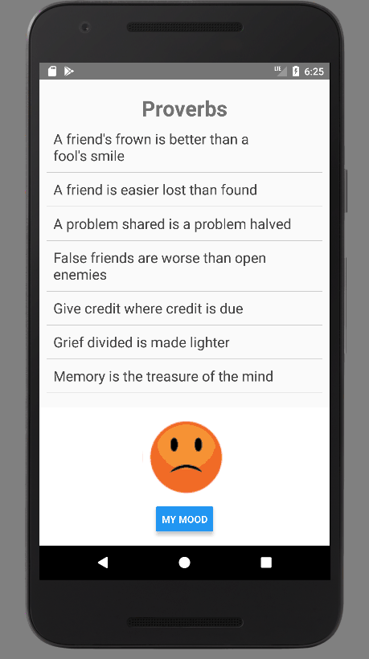

# Learning Basics of React Native

## Concepts Learned in this lesson
1. Adding button and Managing State
    - Adding button
    - Listening to touch events
    - Reacting to press events
    - Managing state
2. Using scrollview
3. Creating custom component

## Preview
